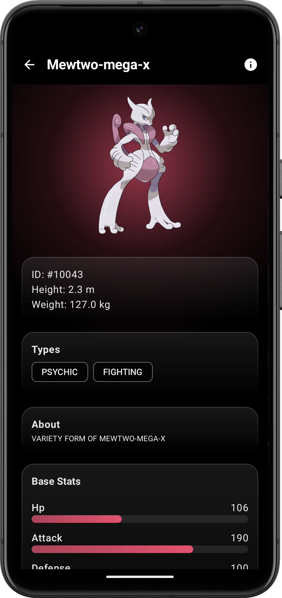

# PokéVerse

A clean, beautiful Pokédex Android app built using **Jetpack Compose**, featuring dynamic theming, glassmorphic UI, and modern Android design principles.

  

---

## 📱 Assets

- ### v1.0.0
  
  &nbsp;&nbsp;&nbsp;  
   
  
- ### v1.0.1
  
  &nbsp;&nbsp;&nbsp;      &nbsp;&nbsp;&nbsp;  
   
   
  

 

https://github.com/user-attachments/assets/97fcc201-ead2-4765-a2d3-2190847c6bf3

---

## ✨ Features

- 🎨 **Pokéball-Themed Background**  
  Home screen background mimics the iconic Pokéball design (red, black, gray).

- ❄️ **Glassmorphic Cards**  
  Detail screen features frosted-glass UI components for stats and metadata.

- 🌈 **Dynamic Type-Based Backgrounds**  
  Background colors change based on the Pokémon’s primary type (e.g., Fire → red/orange, Water → blue).

- 📸 **High-Quality Artwork**  
  Uses official Pokémon artwork from the API for better visuals.

- 🔙 **Smooth Navigation**  
  Back arrow on detail screen for intuitive navigation.

---

## 🚀 Getting Started

### Prerequisites

- Android Studio Meerkat or newer
- Kotlin 1.9+
- Gradle 8+

### Install

install this version from github release by downloading the apk file

---

### 🧭 What's Next

  - [x] 🔍 Search Pokémon by name

  - [x] ⭐ Add to Favorites

  - [x] 📊 Visual Stat Bars

  - [x] 🗃️ Offline Support (Caching)

  - [ ] 🔄 Evolution Chain View
  
---

### 🔧 Tech Stack

  * Jetpack Compose

  * Retrofit2 + Coroutines

  * Material 3 (M3)

  * Coil for Image Loading

  * Koin(for di)
      
    
---

📦 API Source

Data is fetched from 

--- 

💡 Credits

Made with ❤️ by Aditya More.
