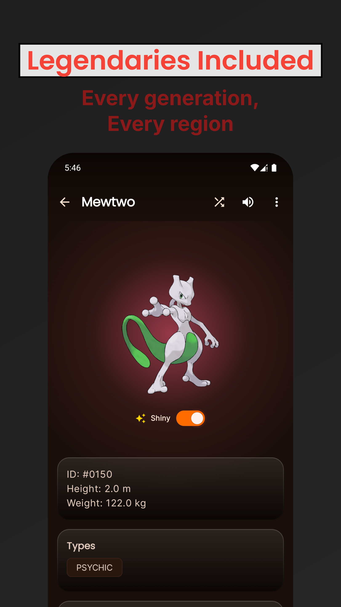
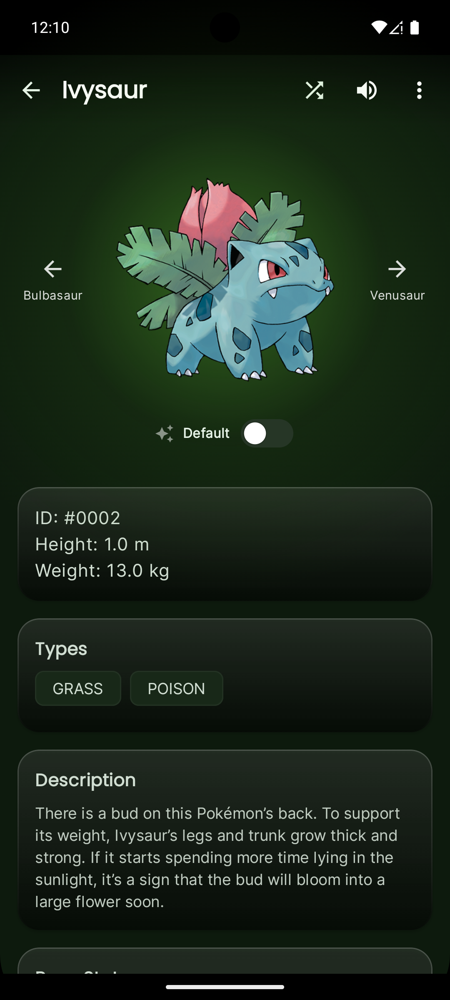
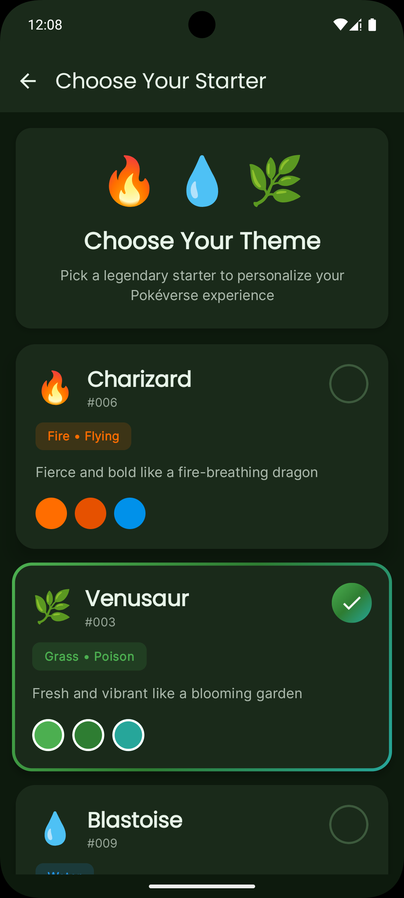

# PokéVerse

> Explore the legends like never before! ✨🚀

## Built using
> 
> 

---

> ## Get from

  
  

---

## Screenshots (Play Store)

|  |  |
|:-------------------------------------------------------------------:|:-------------------------------------------------------------------:|
|  |  |  
|  | 

---  

## More Screenshots

|  |  |
|:-------------------------------------------------------------------:|:-------------------------------------------------------------------:|
|  |  | 
 |

---

## ✨ Features

- 🎨 **Pokéball-Themed Background**  
  Home screen background mimics the iconic Pokéball design (red, black, gray).

- ❄️ **Glassmorphic Cards**  
  Detail screen features frosted-glass UI components for stats and metadata.

- ✨ **Exclusive Particle Effects**
  Get customized particle effects for every single pokemon.

- 🌈 **Dynamic Type-Based Backgrounds**  
  Background colors change based on the Pokémon’s primary type (e.g., Fire → red/orange, Water → blue).

- 📸 **High-Quality Artwork**  
  Uses official Pokémon artwork from the API for better visuals.

- 🔙 **Smooth Navigation**  
  Back arrow on detail screen for intuitive navigation.

---

### 🧭 What's Next

  - [x] 🔍 Search Pokémon by name

  - [x] ⭐ Add to Favorites

  - [x] 📊 Visual Stat Bars

  - [x] 🗃️ Offline Support (Caching)

  - [x] 🔄 Evolution Chain View

  
#### 🚀 Coming Soon

- [ ] 🧩 Advanced Filters (Types, Egg Groups, Regions, Generations)  

- [ ] 🌍 Proper Region Pokédex (Kanto, Johto, Hisui, etc.)  

- [ ] ⚔️ Detailed Moves & Movesets (TMs, Egg Moves, Tutors)  
- [x] 🧠 Smarter Team Builder (Type coverage & weaknesses)  
- [ ] 🎨 Clean Welcome Screen
- [ ] 🏷️ Better Sorting (Stats, Name, Dex No, Type)  
- [ ] 📱 UI & Performance Improvements  
  
---

### 🔧 Tech Stack

  * Jetpack Compose

  * Retrofit2 + Coroutines

  * Material 3 (M3)

  * Coil for Image Loading

  * Koin(for di)
      
    
---

📦 API Source

Data is fetched from 

---

## Get us a Coffee

---

## Follow us on

--- 

💡 Credits

Made with ❤️ by Aditya More.
