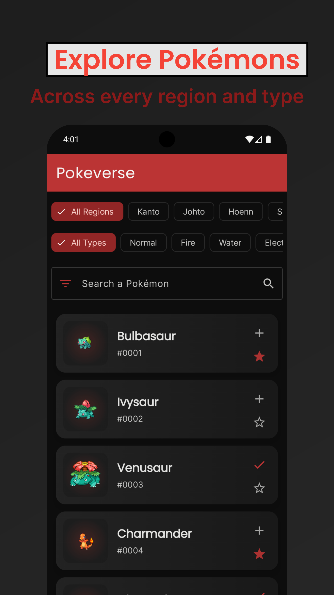
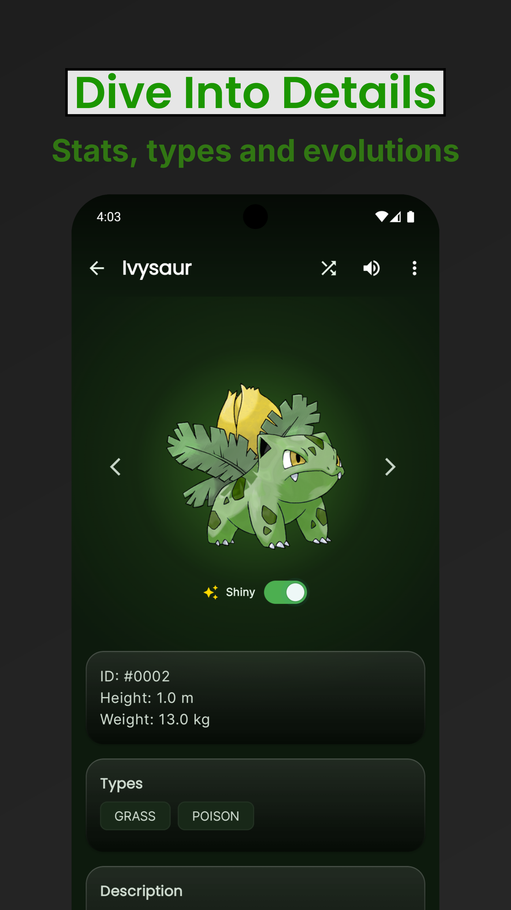
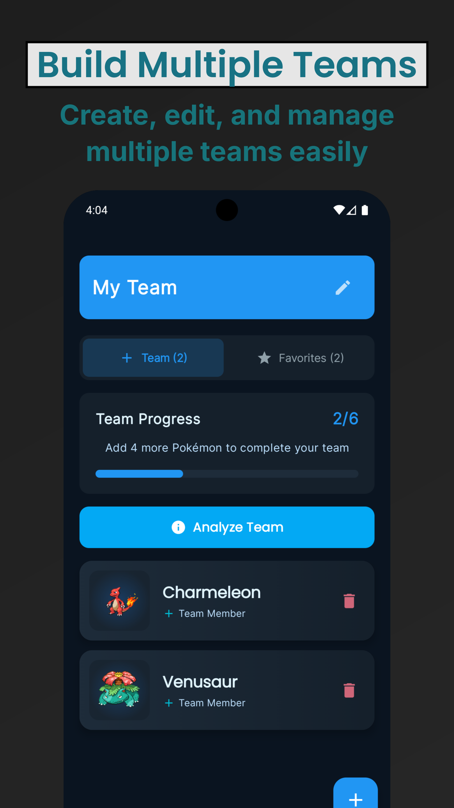
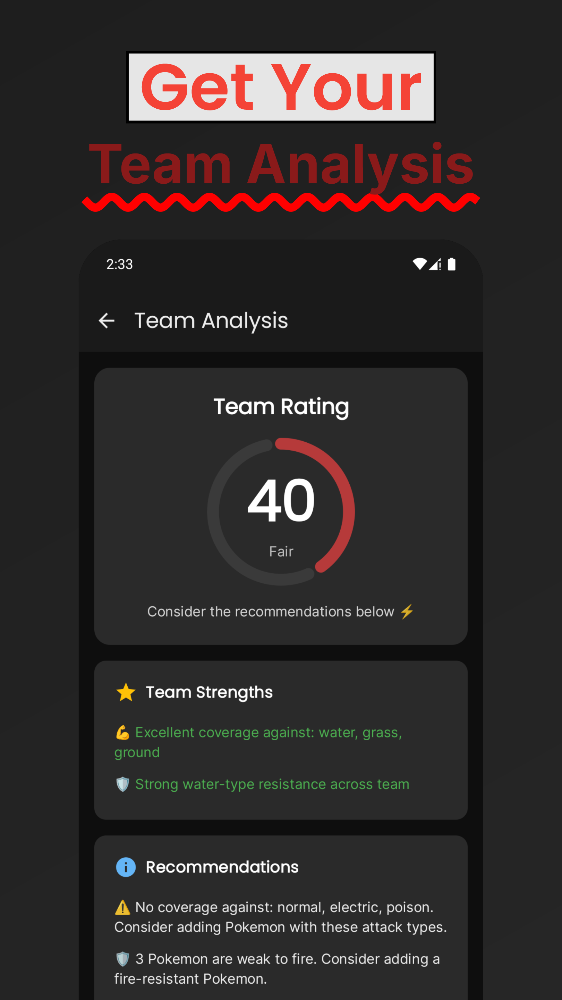
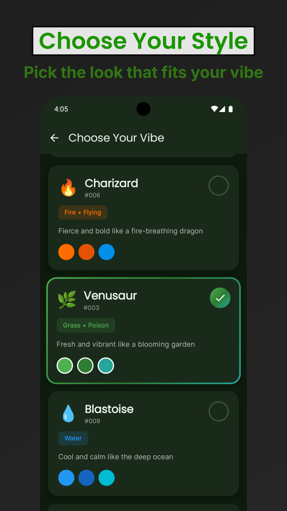

# PokéVerse

> Explore, collect, and manage your Pokémon universe in one app

## Built using
> 
> 

---

## Get from

> 

---

## 📱 Assets

|  |  |
|:-------------------------------------------------------------------:|:-------------------------------------------------------------------:|
|  |  |
|  |  | 

---

## ✨ Features

- 🎨 **Pokéball-Themed Background**  
  Home screen background mimics the iconic Pokéball design (red, black, gray).

- ❄️ **Glassmorphic Cards**  
  Detail screen features frosted-glass UI components for stats and metadata.

- 🌈 **Dynamic Type-Based Backgrounds**  
  Background colors change based on the Pokémon’s primary type (e.g., Fire → red/orange, Water → blue).

- 📸 **High-Quality Artwork**  
  Uses official Pokémon artwork from the API for better visuals.

- 🔙 **Smooth Navigation**  
  Back arrow on detail screen for intuitive navigation.

---

### 🧭 What's Next

  - [x] 🔍 Search Pokémon by name

  - [x] ⭐ Add to Favorites

  - [x] 📊 Visual Stat Bars

  - [x] 🗃️ Offline Support (Caching)

  - [ ] 🔄 Evolution Chain View
  
---

### 🔧 Tech Stack

  * Jetpack Compose

  * Retrofit2 + Coroutines

  * Material 3 (M3)

  * Coil for Image Loading

  * Koin(for di)
      
    
---

📦 API Source

Data is fetched from 

--- 

💡 Credits

Made with ❤️ by Aditya More.
